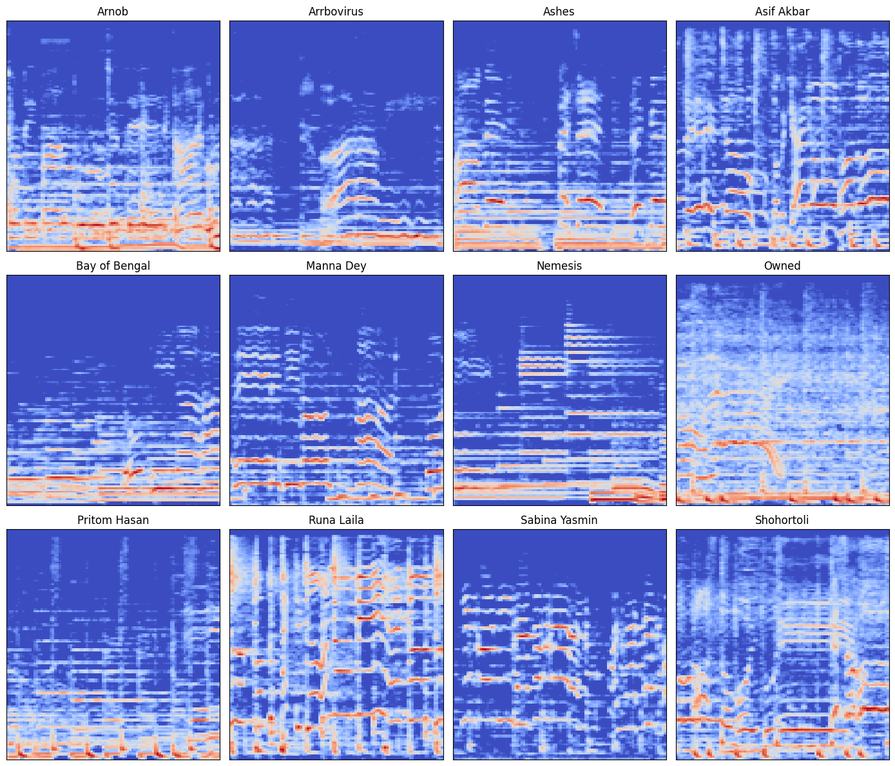

# Deep Learning Approach for Singing Voice Identification in Bangla Songs

## Authors
- Jannatim Maisha
- Farhana Hossain Swarnali
- Md. Azmain Mahtab

## Affiliation
Department of Computer Science and Engineering  
Ahsanullah University of Science and Technology (AUST)  
141 & 142, Love Road, Tejgaon Industrial Area, Dhaka, 1208  
Email: info@aust.edu

## Table of Contents
1. [Related Works](#related-works)
   - [Convolutional Recurrent Neural Network (CRNN) Approach](#convolutional-recurrent-neural-network-crnn-approach)
   - [Comparison Between Neural Network & Other Machine Learning Methods](#comparison-between-neural-network--other-machine-learning-methods)
   - [Employing Mel-Frequency Cepstrum Coefficients (MFCC) Features](#employing-mel-frequency-cepstrum-coefficients-mfcc-features)
   - [Self-Supervised Technique](#self-supervised-technique)
2. [Background Study](#background-study)
3. [Method](#method)
4. [Dataset](#dataset)
5. [References](#references)

## Related Works

### Convolutional Recurrent Neural Network (CRNN) Approach
Xinyu Fu et al. (4) applied a character-aware deep neural classification network, specifically Cha CNN and Char-RNN, for efficient redundancy detection. The model extended the classical Char-CNN structure and incorporated it with the Char-RNN framework. The study utilized the benchmark dataset, and the performance was evaluated using precision, recall, and F1 score. The dataset details and collection methodology were not explicitly mentioned. Tsung-Han Hsieh et al. (5) employed a convolutional recurrent neural network (CRNN) and an extended version named CRNNM for singer identification using the artist20 dataset. This dataset comprises 1,413 song tracks from 20 artists. Audio features, including mel-spectrogram and melody contour, were extracted. Evaluation metrics focused on F1 scores at both the 5-second segment level and the full song level. The study introduced innovative techniques such as vocal separation using the open-unmix tool and a "shuffle-and-remix" data augmentation method. The dataset was manually collected, and the paper addressed potential limitations related to class imbalance. The model achieved state-of-the-art results with an F1 score of 0.75 at the song level. Xulong Zhang et al. (9) introduced singer identification for the metaverse using frame-level features, middle-level features, and timber features. They employed a Convolutional Recurrent Neural Network to combine these three features. The F1 score achieved on the Artist20 benchmark dataset was 0.81. Van et al. (7) utilized a diverse set of models, including convolutional neural networks (CNNs), U-Nets, gated recurrent units (GRUs), and bidirectional LSTM networks, for vocal segmentation, separation, and classification. The vocal segmentation dataset, comprising 2034 Karaoke songs, was collected in-house. Vocal classification involved a dataset of 300 Vietnamese songs from 18 singers, manually collected for the study. Performance metrics encompassed precision, recall, F1 score, and signal-to-distortion ratio (SDR). The vocal classification model achieved an impressive 92.84% F1 score. 

### Comparison Between Neural Network & Other Machine Learning Methods
Al Mamun et al. (1) conducted a comprehensive comparison between various machine learning models, including neural networks (NN), logistic regression, linear regression, support vector machine (SVM), and k-nearest neighbors (k-NN), for the classification of 1742 Bangla songs across six genres. The dataset, sourced from platforms like YouTube, underwent manual curation and genre labeling. Employing key audio features such as zero-crossing rate (ZCR), spectral centroid, and Mel-frequency cepstral coefficients (MFCC), the NN model emerged as the top performer with a notable 74% accuracy, surpassing alternative approaches which achieved 45-64% accuracy. The study underscores the feasibility of deep learning, particularly NN, in comparison to conventional machine learning methods for Bangla music classification. Future work suggestions include exploring larger datasets, integrating additional audio features, and investigating convolutional neural networks (CNNs). Overall, the paper contributes a novel application of deep learning to Bangla music genre classification, establishing a comparative analysis with other models on a newly curated dataset.

### Employing Mel-Frequency Cepstrum Coefficients (MFCC) Features
Ashraf et al. (2) proposed a hybrid architecture involving Convolutional Neural Network (CNN) and variants of Recurrent Neural Network (RNN) for automated music genre classification. The study evaluated different combinations of neural networks based on Mel-spectrogram and Mel-frequency cepstral coefficient (MFCC) features. The hybrid architecture achieved the highest accuracy of 89.30% using CNN and Bi-GRU with Mel-spectrogram, and 76.40% using CNN and LSTM with MFCC. The research emphasized the importance of automating music classification for various applications, utilizing the GTZAN dataset as a benchmark. Eghbal-zadeh et al. (3) focused on music artist recognition in Music Information Retrieval (MIR) using Mel-Frequency Cepstrum Coefficients (MFCC) features. The proposed method achieved an impressive 84.31% accuracy in a 20-class artist recognition task. The study utilized novel song-level timbre-related features, including i-vectors, demonstrating significant advancements and outperforming existing methods. The dataset details were not explicitly mentioned, but the paper outlined future research opportunities, including investigations into singing voice detection systems. The proposed timbral modeling method stands out as an effective approach for music artist recognition, yielding the highest results for the dataset.

### Self-Supervised Technique
Torres et al.(6) proposed self supervised techniques for identifying singers. Self supervised techniques like SimCLR, Uniformity-Alignment,VICR and BYOL are compared which are trained on large collection of isolated vocal tracks. [Cite] gives attention to high frequency(44.1 kHz) regions which are usually ignored. The generalization capabilities of the models are evaluated using out of domain datasets. Yakura et al.(8) uses Self supervised contrastive learning for acquiring feature representations of learning voices. A Classifier is trained for detecting 500 singers using self supervised contrastive learning. Accuracy 63.08% is obtained on Million Song Dataset for identifying 500 singers in this approach.

## Background Study
A very crucial component of traditional Music Information Retrieval (MIR) technique used for capturing frequency con- tent in short-window audio frames is Mel-frequency cepstral coefficients (MFCCs). Recent investigations mostly are all in favor of spectrograms constantly. Spectrograms have been shown to develop better performance in classification tasks by taking use of spatial/time/temporal structures. A spectro- gram is constructed by squaring the magnitude of a signal’s short-time Fourier Transform (STFT), which shows frequency content across time.

Equation (1) is the mathematical formulation for STFT, where x[n] and w[n] stand for the input signal and window function consecuently . Using three-second audio samples from our dataset, (Fig. 1) shows how spectrograms may be used to record both frequency content and period variation. Even though spectrograms might be difficult to understand, fundamental audio features like frequency range and sound presence are obvious.We believe that changes in frequency and time represent a singer’s creative orientations. Thus, we suggest, in order to discover and usethese patterns, Convo- lutional Neural Networks (CNNs) can be utilized, which are reknowned for their skill in pattern recognization within two- dimensional data. 

#### Convolutional Neural Networks (CNNs):  
Convolutional Neural Networks (CNNs) have become very significant in deep learning, particularly for handling visual data, thanks to their performance in works like ImageNet [citation]. The use of convolution to MIR problems was investigated in a prior work conducted by Choi et al. [citation]. This study showed that characteristics may be successfully extracted from audio data via CNN layers. More specifically, higher-level layers record complex/abstract patterns, whereas lower-level layers are able to recognize individual instruments or describe sound onsets. 

#### Convolutional Recurrent Neural Networks (CRNNs):  
One of the audio-related tasks is Speech recognition that Re- current Neural Networks (RNNs) have successfully completed [citation]. They use sound’s tendency to maintain sequen- tial across time. Convolutional Recurrent Neural Networks (CRNNs), which combine a recurrent unit to summarize the time frame after 2D convolution, outperformed four com- monly used audio classification architectures in terms of genre classification performance, according to a follow-up study by Choi et al. [citation]. In this work, we modify the CRNN model to develop an effective deep learning strategy for singer classification.

## Method
#### Audio Processing
To generate spectrograms, a short-time Fourier transform is applied to the raw audio input for each song. The frequency scale (f hertz) is constructed, then translated into the Mel scale 2 (m mels) using Eq. (2) and scaled (d decibels) using Eq. (3). These processes are considered common methods in audio processing and have been shown in previous work to increase classification job performance.

[)](https://www.codecogs.com/latex/eqneditor.php)

[)](https://www.codecogs.com/latex/eqneditor.php)

  

#### Model Architecture and Design  
In our artist classification experiments, we aim to replace traditional MFCC-based approaches with high-dimensional spectrograms. We adopt the CRNN architecture from prior work in genre classification, expecting it to perform well for artist classification due to its ability to capture frequency content changes over time. The CRNN architecture effectively combines convolutional layers for capturing frequency pat- terns and recurrent layers for handling temporal sequences within these patterns. The architecture comprises three stages: convolutional, recurrent, and fully-connected. We use the Exponential Linear Unit (ELU) activation function as a smooth alternative to Rectified Linear Unit (RELU) for better gener- alization. Batch normalization and dropout are included for regularization and improved generalization, following prac- tices in image classification. Pooling and stride parameters are chosen to fully characterize the 128-bin frequency axis and summarize the sequence length entering the recurrent layer. The recurrent component, employing Gated Recurrent Units (GRUs), acts as a form of temporal summarization, replacing the need for explicit temporal pooling. GRUs are preferred over Long Short-Term Memory (LSTM) cells due to their efficiency in terms of parameters and comparable performance. The final fully-connected layer utilizes a softmax activation to assign probabilities to each class, completing the model’s architecture.

## Dataset
In this study, we created our own dataset consisting of 12 artists and a total of 470 songs. The dataset consists of 6 Rock, 4 Pop & 2 Folk genre artists and 6 of the artists are Band artists(one vocal). There are The dataset was downloaded from official youtube public playlists for those artists. It was then converted to 32 kbps Bitrate, 16 kHz Sample Rate and mono channel specification for simplification and size reduction. Spectrograms are generated for the entire duration of each song to establish an initial dataset. Following that, a 90/10 song split stratified by artist is used to divide the dataset into training and test sets. Furthermore, the training set is stratified 90/10 to form training and validation subsets. This stratification ensures that each artist’s songs are represented fairly in each set.

## References
1. Md. Afif Al Mamun, Imamul Kadir, AKM Shahariar Azad Rabby, and Abdullah Al Azmi. [Bangla music genre classification using neural network](#bangla-music-genre-classification-using-neural-network). In 2019 8th International Conference System Modeling and Advancement in Research Trends (SMART), pages 397–403, 2019.
2. Mohsin Ashraf, Fazeel Abid, Ikram Ud Din, Jawad Rasheed, Mirsat Yesiltepe, Sook Fern Yeo, and Merve T. Ersoy. [A hybrid cnn and rnn variant model for music classification](#a-hybrid-cnn-and-rnn-variant-model-for-music-classification). Applied Sciences, 13(3), 2023.
3. Hamid Eghbal-zadeh, Markus Schedl, and Gerhard Widmer. [Timbral modeling for music artist recognition using i-vectors](#timbral-modeling-for-music-artist-recognition-using-i-vectors). In 2015 23rd European Signal Processing Conference (EUSIPCO), pages 1286–1290, 2015.
4. Xinyu Fu, Eugene Ch’ng, Uwe Aickelin, and Simon See. [Crnn: A joint neural network for redundancy detection](#crnn-a-joint-neural-network-for-redundancy-detection), 2017.
5. Tsung-Han Hsieh, Kai-Hsiang Cheng, Zhe-Cheng Fan, Yu-Ching Yang, and Yi-Hsuan Yang. [Addressing the confounds of accompaniments in singer identification](#addressing-the-confounds-of-accompaniments-in-singer-identification), 2020.
6. Bernardo Torres, Stefan Lattner, and Gael Richard. [Singer Identity Representation Learning using Self-Supervised Techniques](#singer-identity-representation-learning-using-self-supervised-techniques). In International Society for Music Information Retrieval Conference (ISMIR 2023), Milan, Italy, November 2023.
7. Toan Pham Van, Ngoc Tran Ngo Quang, and Ta Minh Thanh. [Deep learning approach for singer voice classification of Vietnamese popular music](#deep-learning-approach-for-singer-voice-classification-of-vietnamese-popular-music). In Proceedings of the Tenth International Symposium on Information and Communication Technology - SoICT 2019, SoICT 2019. ACM Press, 2019.
8. Hiromu Yakura, Kento Watanabe, and Masataka Goto. [Self-supervised contrastive learning for singing voices](#self-supervised-contrastive-learning-for-singing-voices). IEEE/ACM Transactions on Audio, Speech, and Language Processing, 30:1614–1623, 2022.
9. Xulong Zhang, Jianzong Wang, Ning Cheng, and Jing Xiao. [Singer identification for metaverse with timbral and middle-level perceptual features](#singer-identification-for-metaverse-with-timbral-and-middle-level-perceptual-features), 2022.
